# **MasterCode**

## **Application Overview**

MasterCode is a terminal-based, code breaker game based on [_Mastermind_](<https://en.wikipedia.org/wiki/Mastermind_(board_game)>), originally created by Mordecai Meirowitz.

The game itself is faithful to the traditional rules of _Mastermind_ - a secret code of 4 colours is randomly generated from a selection of 6 different colours, and concealed from the player. The player is then given 12 attempts to guess the secret code. If the player succeeds, they win! But if they do not, they lose. Duplicate colours are allowed, which adds to the overall difficulty of the game.

The style of the game is inspired by classic text-based adventure role-playing games, and thematically borrows from - and serves as an homage to - Nintendo's magnificent and iconic [_The Legend of Zelda_](https://zelda.com/about/) franchise. I chose the name 'MasterCode' due to its similarity to both _Mastermind_ (by which most people would recognise this style of game), and of course to the famous _Master Sword_ wielded by the hero of Hyrule himself.

When creating this game, I really wanted to focus on recreating the light-hearted (to a fashion!), whimsical feel of some older text-based adventure games, as well as beloved classics from _The Legend of Zelda's_ titles such as _Ocarina of Time_, which remains one of my favourite entries in the franchise. Overall, I like to hope that this game will be experienced with the same charmed sense of humour that I felt when making it.

[**_Please follow this link to the final deployed version of this project._**](https://mastercode-breaker-0e80af73ee79.herokuapp.com/)

## **Table of Contents:**

1. [**Application Overview**](#application-overview)
1. [**Planning Stages**](#planning-stages)
   - [**Target Audience**](#target-audience)
   - [**User Stories**](#user-stories)
   - [**Application Aims**](#application-aims)
   - [**UX Flow Chart**](#ux-flow-chart)
   - [**Technology Used**](#technology-used)
     - [**_Libraries_**](#libraries)
1. [**Current Features**](#current-features)
   - [**Main Menu**](#main-menu)
     - [**_Main Logo Graphic_**](#main-logo-graphic)
     - [**_Instructions_**](#instructions)
     - [**_Bonus Triforce!_**](#bonus-triforce)
     - [**_Exit Game_**](#exit-game)
   - [**Run Game**](#run-game)
     - [**_Generating the Secret Code_**](#generating-the-secret-code)
   - [**Player Guess Input with Error Handling**](#player-guess-input-with-error-handling)
   - [**Comparing Player Guess to Secret Code**](#comparing-player-guess-to-secret-code)
     - [**_Player Guess Ouput_**](#player-guess-ouput)
   - [**Graphics and Messages**](#graphics-and-messages)
     - [**_Header Graphic_**](#header-graphic)
     - [**_You Win!_**](#you-win-graphic-and-message)
     - [**_Game Over_**](#game-over-graphic-and-message)
     - [**_Divider Graphic_**](#divider-graphic)
   - [**Play Again Function with Error Handling**](#play-again-function-with-error-handling)
   - [**Clear Screen Function**](#clear-screen-function)
1. [**Considerations for Future Enhancements**](#considerations-for-future-enhancements)
1. [**Testing**](#testing)
1. [**Deployment**](#deployment)
1. [**Credits**](#credits)
   - [**Honourable Mentions**](#honourable-mentions)
   - [**Code and Content References**](#code-and-content-references)

## **Planning Stages**

### **Target Audience**

This game has been created with a wide target audience in mind. _Mastermind_, and similar games sharing the same core concepts, is a classic that is suitable for all ages. According to Hasbro, who currently hold the trademarks for _Mastermind_, the game is suitable for ages 8 and above. Naturally, this is a terminal-based game and is unlikely to be something children would happen upon organically, however (with adult supervision at a computer), this game would be suitable, as Hasbro indicate, for children aged 8 and above.

The addition of the text-based adventure elements, and inclusion of _The Legend of Zelda_-inspired features, also opens this game up to audiences who are interested in one or both of these things, with a taste for nostalgic or 'retro' gaming formats.

### **User Stories**

As a user:

- I would like to play a fun and engaging code breaker game based on _Mastermind_, with retro RPG elements.
- I wish to clearly see what game I am playing.
- I wish to have the choice to play the game straight from the menu.
- I need to be able to access the instructions for the game directly from the menu, should I have need of them.
- I want to see the legendary Triforce!
- When playing the game, I would like to see the visual representation of my guesses.
- When I have entered my guess, I want to see how many colours in my guess were correct and in the right position, and how many were correct but in the wrong position, so that I can advance the game without being in the dark.
- I want to be reminded of how many attempts I have remaining.
- I wish for feedback in the form of enjoyable graphics that represent whether I won the game or lost the game.
- I want to be able to exit the game from the menu.

### **Application Aims**

This application aims to:

- Provide a fun and engaging, text adventure style, code breaking game that - as mentioned previously - wishes to be treated with a whimsical sense of humour.
- Make clear to the player that they are able to play the game, read the instructions, exit the game and even see the legendary Triforce directly from the main menu.
- Provide the user with an attractive but simple user interface that is clear, and provides easy to understand feedback.
- Run successfully as a continuous loop for as long as the player needs, without crashing due to errors in either the logic or in the player's input.

### **UX Flow Chart**

### **Technology Used**

This project has been written entirely in Python (version 3.11.4, which is the latest version at the time of making this game).

#### **Libraries**

Two libraries were imported for this code:

**_random_**:

- random.choice() was utilised in the generate_code() function for the game, and is necessary in order to create a randomly generated code of 4 colours from the 6 possible colour options.

**_os_**:

- os.name and os.system() were used in the clear_screen() function, which checks to see if the os.name == "posix", and if to clear the screen using os.system("clear"). Otherwise, the screen is cleared by used os.system("cls").

## **Current Features**

### **Main Menu with Error Handling**

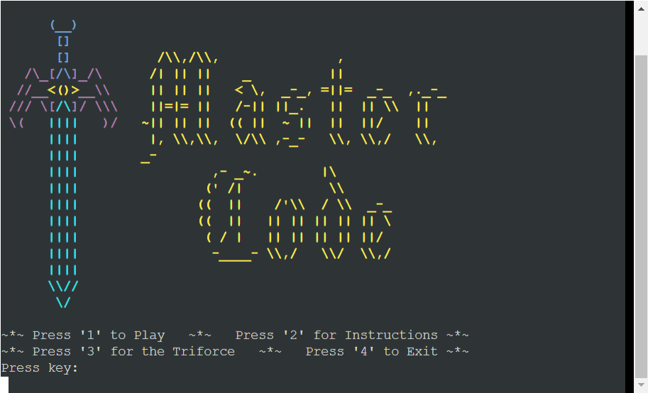

The main menu screen is the first thing the player sees upon starting the program. It displays the main logo graphic, and below it provides the user with four options:

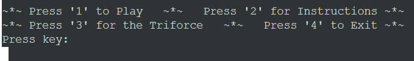

In order to progress away from the main menu, the player is required to press one of these four options to take them to their required destination in the program.

As Python automatically converts input into strings, the user input is first converted to an integer using the built-in 'int()' function. The int(input()) function sits within a try statement, that assumes there will be no error in the code and directs the player to the appropriate part of the program if they enter 1, 2, 3, or 4. A ValueError is then raised in an except statement that acts as a catch-all for any input that is not a 1, 2, 3, or 4. Shown below are a number of examples, including entering an invalid number, a letter, a special character, multiples of valid numbers (therefore becoming invalid numbers), and the text version of a number:

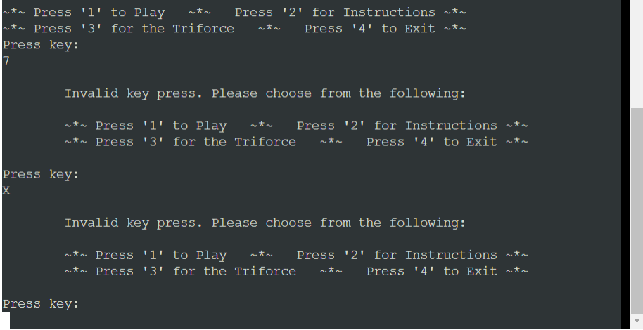

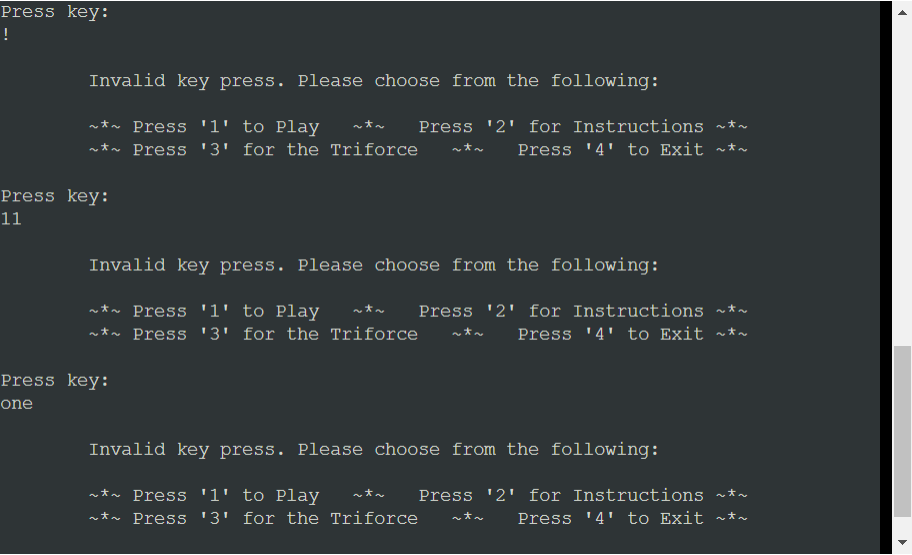

#### **Main Logo Graphic**

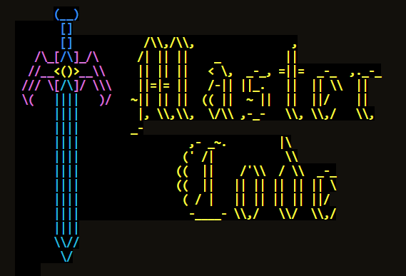

The main logo for this game is something I put together by using and tweaking existing ASCII art resources. I used the following sword by 'Krogg' from the [ASCII Art Archives](https://www.asciiart.eu/weapons/swords):

...which I then edited to be the opposite way round, and reshaped it slightly. I then added the following text in 'Gothic' from [patorjk.com's ASCII Text Generator](https://patorjk.com/software/taag/#p=display&f=Gothic&t=Master%0ACode):

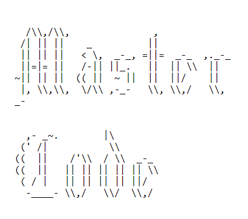

...and simply combined them before finally adding colours by importing them from my 'Colors' class, which contains the ANSI escape codes to be used with their respective colors.

Unfortunately, I have found that the graphic displays in an odd fashion on Heroku, but only for the first time the menu is shown to the player. Unlike other graphics which make the background colour uniform, for some reason this particular one creates a notable difference between the terminal background and the background of the characters that make up the graphic. However, as one can never assume that all terminals will respond in the same way, this didn't come as a huge surprise and I don't think it takes away from the experience.

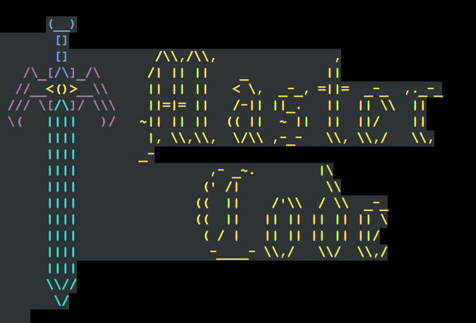

#### **Instructions**

Atop the instructions page, there is a banner graphic that features the name of the game, and a different sword that is similarly coloured to the main logo sword, and acts as a divider. This is detailed further in a later section.

This is what the player will see if they press '2' to read the instructions before playing the game:

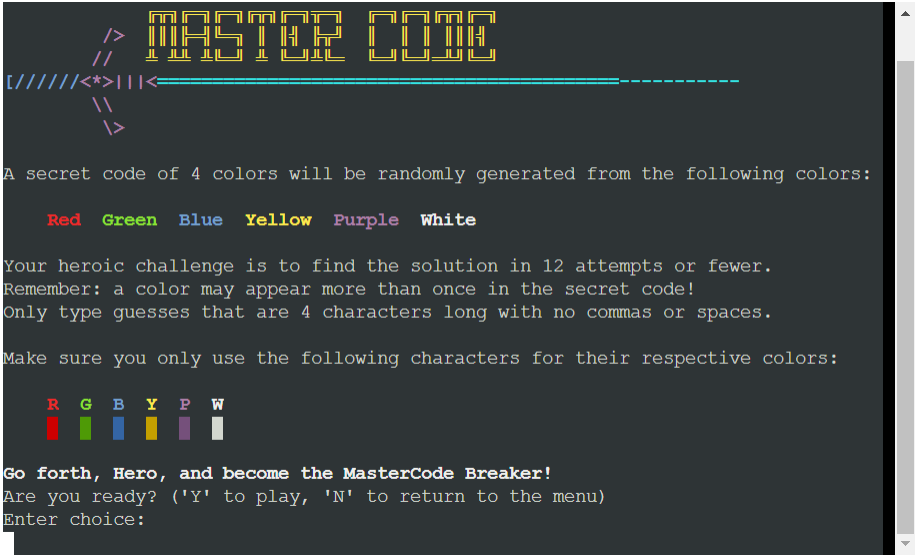

They have been stylised for a more pleasant user experience, and colours have been used to clearly indicate the choices the player has when making their guesses. A fun message of encouragement has been added to the bottom to help players feel ready to set out on their heroic adventure!

Below the instructions, the play_again() function is called, which is detailed in a later section.

#### **Bonus Triforce!**

During the making of this game, I found it harder and harder to resist the urge to include an "easter egg" of sorts (though it can hardly be described as such, due to not being very hidden!), in the form of "Press '3' for the Triforce!"

I was pleased to discover that there is no shortage of options when it comes to including the Triforce in Python code, but of all the ones I came across, I thought this one (created by John Cartwright as mentioned in the [Credits](#credits) section) was not only the most visually appealing, but also the most interesting as it involves actual code, rather than being an ASCII graphic.

Really this is just a fun gimmick, with a nod to both _Ocarina of Time_ in the form of Navi's infamous "Hey! Listen!" and a description of the Triforce from the [_The Legend of Zelda Instruction Booklet_](https://www.nintendo.co.jp/clv/manuals/en/pdf/CLV-P-NAANE.pdf) which was released alongside the original _The Legend of Zelda_ video game in 1986.

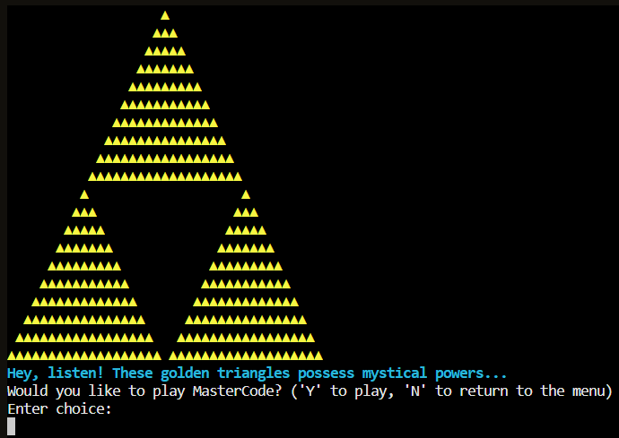

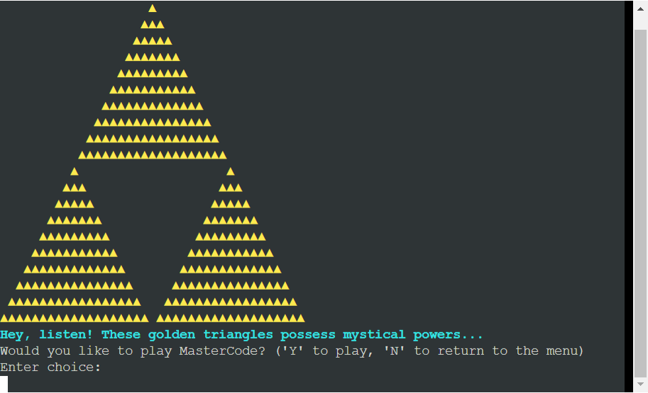

Below the Triforce graphic and cyan text, the play_again() function is called, which is detailed in a later section.

#### **Exit Game**

If the player wishes to exit the game from the menu, they can press '4', and the following graphic will display before the program will close and no further input can be entered into the terminal:

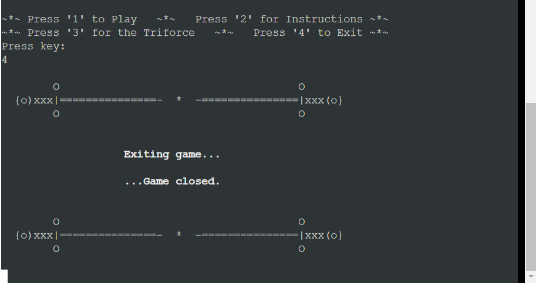

The sword pattern used as a divider for the text is taken directly from the [ASCII Art Archives](https://www.asciiart.eu/weapons/swords).

### **Run Game**

When the user either enters '1' from the main menu, or enters 'Y' in the play_again() function (detailed in a later section), the run_game() function is called and the game begins and the player is met with the following screen:

The same header/banner graphic seen on the instructions sits at the top of the page, which creates a sense of famliarity for the user, and a short summary of the game in a playful and entertaining way that befits the overall theme of the game.

#### **Generating the Secret Code**

### **Player Guess Input with Error Handling**

### **Comparing Player Guess to Secret Code**

#### **Player Guess Ouput**

### **Graphics and Messages**

#### **Header Graphic**

#### **You Win! Graphic and Message**

#### **Game Over Graphic and Message**

#### **Divider Graphic**

### **Play Again Function with Error Handling**

### **Clear Screen Function**

## **Considerations for Future Enhancements**

## **Testing**

A separate file has been created for information about testing. Please click the following link to access it: [**TESTING.md**](TESTING.md)

## **Deployment**

## **Credits**

### **Honourable Mentions**

### **Code and Content References**
