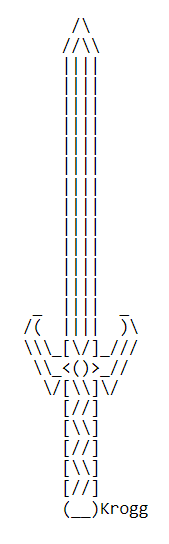

# **MasterCode**

## **Application Overview**

MasterCode is a terminal-based, code breaker game based on [_Mastermind_](<https://en.wikipedia.org/wiki/Mastermind_(board_game)>), originally created by Mordecai Meirowitz.

The game itself is faithful to the traditional rules of _Mastermind_ - a secret code of 4 colours is randomly generated from a selection of 6 different colours, and concealed from the player. The player is then given 12 attempts to guess the secret code. If the player succeeds, they win! But if they do not, they lose. Duplicate colours are allowed, which adds to the overall difficulty of the game.

The style of the game is inspired by classic text-based adventure role-playing games, and thematically borrows from - and serves as an homage to - Nintendo's magnificent and iconic [_The Legend of Zelda_](https://zelda.com/about/) franchise. I chose the name 'MasterCode' due to its similarity to both _Mastermind_ (by which most people would recognise this style of game), and of course to the famous _Master Sword_ wielded by the hero of Hyrule himself.

When creating this game, I really wanted to focus on recreating the light-hearted (to a fashion!), whimsical feel of some older text-based adventure games, as well as beloved classics from _The Legend of Zelda's_ titles such as _Ocarina of Time_, which remains one of my favourite entries in the franchise. Overall, I like to hope that this game will be experienced with the same charmed sense of humour that I felt when making it.

[**_Please follow this link to the final deployed version of this project._**](https://mastercode-breaker-0e80af73ee79.herokuapp.com/)

## **Table of Contents:**

1. [**Application Overview**](#application-overview)
1. [**Planning Stages**](#planning-stages)
   - [**Target Audience**](#target-audience)
   - [**User Stories**](#user-stories)
   - [**Application Aims**](#application-aims)
   - [**UX Flow Chart**](#ux-flow-chart)
   - [**Technology Used**](#technology-used)
     - [**_Libraries_**](#libraries)
1. [**Current Features**](#current-features)
   - [**Main Menu**](#main-menu)
     - [**_Main Logo Graphic_**](#main-logo-graphic)
     - [**_Instructions_**](#instructions)
     - [**_Bonus Triforce!_**](#bonus-triforce)
     - [**_Exit Game_**](#exit-game)
   - [**Run Game**](#run-game)
     - [**_Generating the Secret Code_**](#generating-the-secret-code)
   - [**Player Guess Input with Error Handling**](#player-guess-input-with-error-handling)
   - [**Comparing Player Guess to Secret Code**](#comparing-player-guess-to-secret-code)
     - [**_Player Guess Ouput_**](#player-guess-ouput)
   - [**Game Graphics and Messages**](#game-graphics-and-messages)
     - [**_You Win!_**](#you-win-graphic-and-message)
     - [**_Game Over_**](#game-over-graphic-and-message)
   - [**Play Again Function with Error Handling**](#play-again-function-with-error-handling)
   - [**Clear Screen Function**](#clear-screen-function)
1. [**Considerations for Future Enhancements**](#considerations-for-future-enhancements)
   - [**Difficulty Levels**](#difficulty-levels)
   - [**Story-Based Levels**](#story-based-levels)
   - [**Improved UI**](#improved-ui)
   - [**Accessibility Features**](#accessibility-features)
1. [**Testing**](#testing)
1. [**Deployment**](#deployment)
   - [**Cloning/Forking to Local Environments**](#cloningforking-to-local-environments)
   - [**Final Deployment (Heroku)**](#final-deployment-heroku)
1. [**Credits**](#credits)
   - [**Honourable Mentions**](#honourable-mentions)
   - [**Code and Content References**](#code-and-content-references)

## **Planning Stages**

### **Target Audience**

This game has been created with a wide target audience in mind. _Mastermind_, and similar games sharing the same core concepts, is a classic that is suitable for all ages. According to Hasbro, who currently hold the trademarks for _Mastermind_, the game is suitable for ages 8 and above. Naturally, this is a terminal-based game and is unlikely to be something children would happen upon organically, however (with adult supervision at a computer), this game would be suitable, as Hasbro indicate, for children aged 8 and above.

The addition of the text-based adventure elements, and inclusion of _The Legend of Zelda_-inspired features, also opens this game up to audiences who are interested in one or both of these things, with a taste for nostalgic or 'retro' gaming formats.

### **User Stories**

As a user:

- I would like to play a fun and engaging code breaker game based on _Mastermind_, with retro RPG elements.
- I wish to clearly see what game I am playing.
- I wish to have the choice to play the game straight from the menu.
- I need to be able to access the instructions for the game directly from the menu, should I have need of them.
- I want to see the legendary Triforce!
- When playing the game, I would like to see the visual representation of my guesses.
- When I have entered my guess, I want to see how many colours in my guess were correct and in the right position, and how many were correct but in the wrong position, so that I can advance the game without being in the dark.
- I want to be reminded of how many attempts I have remaining.
- I wish for feedback in the form of enjoyable graphics that represent whether I won the game or lost the game.
- I want to be able to exit the game from the menu.

### **Application Aims**

This application aims to:

- Provide a fun and engaging, text adventure style, code breaking game that - as mentioned previously - wishes to be treated with a whimsical sense of humour.
- Make clear to the player that they are able to play the game, read the instructions, exit the game and even see the legendary Triforce directly from the main menu.
- Provide the user with an attractive but simple user interface that is clear, and provides easy to understand feedback.
- Run successfully as a continuous loop for as long as the player needs, without crashing due to errors in either the logic or in the player's input.

### **UX Flow Chart**

### **Technology Used**

This project has been written entirely in Python (version 3.11.4, which is the latest version at the time of making this game).

#### **Libraries**

Two libraries were imported for this code:

**_random_**:

- random.choice() was utilised in the generate_code() function for the game, and is necessary in order to create a randomly generated code of 4 colours from the 6 possible colour options.

**_os_**:

- os.name and os.system() were used in the clear_screen() function, which checks to see if the os.name == "posix", and if to clear the screen using os.system("clear"). Otherwise, the screen is cleared by used os.system("cls").

## **Current Features**

### **Main Menu with Error Handling**

The main menu screen is the first thing the player sees upon starting the program. It displays the main logo graphic, and below it provides the user with four options:

In order to progress away from the main menu, the player is required to press one of these four options to take them to their required destination in the program.

As Python automatically converts input into strings, the user input is first converted to an integer using the built-in 'int()' function. The int(input()) function sits within a try statement, that assumes there will be no error in the code and directs the player to the appropriate part of the program if they enter 1, 2, 3, or 4. A ValueError is then raised in an except statement that acts as a catch-all for any input that is not a 1, 2, 3, or 4. Shown below are a number of examples, including entering an invalid number, a letter, a special character, multiples of valid numbers (therefore becoming invalid numbers), and the text version of a number:

#### **Main Logo Graphic**

The main logo for this game is something I put together by using and tweaking existing ASCII art resources. I used the following sword by 'Krogg' from the [ASCII Art Archives](https://www.asciiart.eu/weapons/swords):

...which I then edited to be the opposite way round, and reshaped it slightly. I then added the following text in 'Gothic' from [patorjk.com's ASCII Text Generator](https://patorjk.com/software/taag/#p=display&f=Gothic&t=Master%0ACode):

...and simply combined them before finally adding colours by importing them from my 'Colors' class, which contains the ANSI escape codes to be used with their respective colors.

Unfortunately, I have found that the graphic displays in an odd fashion on Heroku, but only for the first time the menu is shown to the player. Unlike other graphics which make the background colour uniform, for some reason this particular one creates a notable difference between the terminal background and the background of the characters that make up the graphic. However, as one can never assume that all terminals will respond in the same way, this didn't come as a huge surprise and I don't think it takes away from the experience as it only happens the very first time the program is started.

#### **Instructions**

Atop the instructions page, there is a banner graphic that features the name of the game, and a different sword that is similarly coloured to the main logo sword, and acts as a visual reminder to the user what they are playing, and creates a sense of familiarity.

This is what the player will see if they press '2' to read the instructions before playing the game:

They have been stylised for a more pleasant user experience, and colours have been used to clearly indicate the choices the player has when making their guesses. A fun message of encouragement has been added to the bottom to help players feel ready to set out on their heroic adventure!

Below the instructions, the play_again() function is called, which is detailed in a later section.

#### **Bonus Triforce!**

During the making of this game, I found it harder and harder to resist the urge to include an "easter egg" of sorts (though it can hardly be described as such, due to not being very hidden!), in the form of "Press '3' for the Triforce!"

I was pleased to discover that there is no shortage of options when it comes to including the Triforce in Python code, but of all the ones I came across, I thought this one (created by John Cartwright as mentioned in the [Credits](#credits) section) was not only the most visually appealing, but also the most interesting as it involves actual code, rather than being an ASCII graphic.

Really this is just a fun gimmick, with a nod to both _Ocarina of Time_ in the form of Navi's infamous "Hey! Listen!" and a description of the Triforce from the [_The Legend of Zelda Instruction Booklet_](https://www.nintendo.co.jp/clv/manuals/en/pdf/CLV-P-NAANE.pdf) which was released alongside the original _The Legend of Zelda_ video game in 1986.

Below the Triforce graphic and cyan text, the play_again() function is called, which is detailed in a later section.

#### **Exit Game**

If the player wishes to exit the game from the menu, they can press '4', and the following graphic will display before the program will close and no further input can be entered into the terminal:

The sword pattern used as a divider for the text is taken directly from the [ASCII Art Archives](https://www.asciiart.eu/weapons/swords).

### **Run Game**

When the user either enters '1' from the main menu, or enters 'Y' in the play_again() function (detailed in a later section), the run_game() function is called and the game begins and the player is met with the following screen:

The same header/banner graphic seen on the instructions sits at the top of the page, which creates a sense of famliarity for the user, and a short summary of the game in a playful and entertaining way that befits the overall theme of the game.

#### **Generating the Secret Code**

The secret code is randomly generated using the Python's random library. Two costants have been declared that are crucial for the creation of this random secret code: 'COLOR_CHOICES', which is a list of the 6 accepted characters for the colour choices as strings, and 'CODE_LENGTH' which determined how long the code is. The generate_code() function contains an empty list, and a while loop that tells the program that so long as the length of this empty list is less than the length of 'CODE_LENGTH', the following code needs to be run: random.choice(COLOR_CHOICES) and the result is then appended to the empty list. By using this method, the function is still valid if one or both of the 'COLOR_CHOICES' and 'CODE_LENGTH' constants are updated to include different values or lengths.

### **Player Guess Input with Error Handling**

As with the main menu input, ValueErrors have been used to make sure that the user can only input one of the specified valid character options, and that the program doesn't crash or cause bugs if invalid characters are entered. If they enter anything other than the valid options, they receive an error that tells them they have entered one or more invalid characters, and reminds them of the valid characters. If they enter a guess that is not equal to the specified code length, using valid or invalid characters, they receive an error telling them so and reminding them of the valid characters.

Once again, the constants 'COLOR_CHOICES' and 'CODE_LENGTH' are used here so that the ValueError outputs the correct information to the user in the event that either constant is updated.

To prevent any issues that could be caused by players entering the correct characters, but in lower case, Python's built-in upper() function has been used to automatically convert all inputs to upper case.

### **Comparing Player Guess to Secret Code**

The method used to compare the player's guess with the secret code involves iterating through the guess (returned as a list), and iterating through the generated code (also returned as a list) to check for two things.

Firstly, the characters are compared specifically against their index numbers on the list. For example, if the first character the player has entered in their guess (index[0]) is an exact match to the generated code's first character (index[0]), the 'correct_position' variable is increased.

The remaining characters in the user's guess are then iterated through using Python's built-in enumerate() function, and any matching characters with an incorrect index position increase the value of the 'correct_color' variable before also being removed.

The 'correct_position' and 'correct_color' variables are then returned to be used in the run_game() function.

Care was taken to make sure that characters in the correct position are searched for and removed before the program looks for characters in the correct position, and that correct colours in the wrong place are also removed. This is to prevent a number of issues that could arise from double counting - mainly that it could either be extremely miseleading to the player and make the game unwinnable, or give clues to the player as to whether there are duplicates in the code.

#### **Player Guess Ouput**

The display_player_guess() function takes the player's guess as an argument, and converts each character into their matching block colour, to give the player a visual reminder of what they have guessed so far. Below this, they are told how many characters are in the correct position, how many colours they have correct which are in the wrong position, and how many attempts they have remaining.

### **Game Graphics and Messages**

Depending on whether the player is able to correctly guess the code within the specified number of attempts and win the game, or whether they are unable to do so and lose the game, they will see a different graphic and accompanying message. In both instances, the player is shown what the secret code was.

#### **You Win! Graphic and Message**

When the player wins the game, this green 'You Win!' graphic is displayed. The text was generated by [patorjk.com's ASCII Text Generator](https://patorjk.com/software/taag/#p=display&f=Gothic&t=Master%0ACode), and as with the banner image, I used a sword found on [ASCII Art Archives](https://www.asciiart.eu/weapons/swords) and added the two together (recreating the reverse of the sword myself).

The player is given congratulations on completing their heroic task, and told how many attempts it took them before asking them if they want to play again.

#### **Game Over Graphic and Message**

If the player cannot guess the code and runs out of attempts, a bloodied 'Game Over' graphic is displayed. Once again, the text was generated using [patorjk.com's ASCII Text Generator](https://patorjk.com/software/taag/#p=display&f=Gothic&t=Master%0ACode), though the specific idea to use this style/font for the graphic is thanks to [PeterQ93](https://github.com/PeterQ93/hangman) (mentioned in the [Credits](#credits) section).

A short line of text explains that the player was 'defeated' this time, but not to despair, before asking if they would like to try again.

### **Play Again Function with Error Handling**

The play_game() function is named as such because it runs at the end of each instance of the game, whether the player wins or loses. However, it does also run at the end of the instructions page, as well as the Triforce page. It is a simple input function, similar to the one found in the main menu, which gives the player two options: Press 'Y' to play the game, press 'N' to return to the main menu. The wording is adjusted based on where the function is called, so that it always makes contextual sense to the user.

As with all other input functions in this game, error handling is used in the form of a ValueError for any key presses that are not 'Y' or 'N'. If the user enters 'y' or 'n', the upper() function is used to convert them to upper case to avoid any confusion. If any other characters are entered, such as numbers, special characters or other letters, the following error appears:

After the 'Game Over' screen:

At the end of the instructions page:

### **Clear Screen Function**

The clear_screen() function exists to clear the terminal before running the code that follows it, to make it less messy and to make the user feel as though they are in separate 'sections' of the program. It can be found inside the main_menu() function, before the triforce() function is called from the main menu, in the run_game() function, and in the play_again() function.

**_Please note: this function does not work as intended in the final deployed version of this game on Heroku, due to relying on Python's os.system() function. As this project is being hosted in a virtual environment, OS information is not available._**

## **Considerations for Future Enhancements**

I have a lot of grand ideas that, if time were not a factor, I would see implemented into this game. Some of those ideas are reasonably simple, but others much more complex that would involve a great deal of time and consideration in order to implement them well.

### Difficulty Levels

One of the reasonably simple improvements I think this game would benefit from is the introducton of difficulty levels. If I could go back to the project inception stage, I think I would include this from the start. However, it was too late a consideration to begin implementing in the way I would want to. After thinking about it, I decided I didn't want to introduce difficult settings that were based on number of attempts alone, but also on factors such as whether the generated code can repeat colours, how many repetitions are allowed, how many choices, etc. This would make for a much more interesting player experience. Unfortunately I did not feel like I had the time to sit down and really work out what I wanted the parameters of the difficulty settings to be, and how I wanted them to be implemented.

### Story-Based Levels

In relation to the above point about difficult settings, ideally I would love to be able to make different levels, perhaps starting at easy and then ramping up in difficulty as the player progresses. I would like to tie these increases in difficulty into story elements, somehow.

Originally, my first thought for what I wanted to make for this project was an actual text-based adventure game, but time contraints and self-confessed limits in my story-writing capability made me realise that it was an impractical and likely unachievable goal. This was what led me to the idea of creating a game that borrows from the style and character of those games instead. I think it would be so fun and unique to have an adventurer's story that progresses further the more puzzles the player can solve. Of course, this would be an enormous job in terms of writing the story alone, to say nothing of the logic, but it is definitely high up on my list of enhancements I would make if I could.

### Improved UI

Obviously, in a command line application that doesn't utilise graphical libraries such as Pygame, it can be expected that the UI will not be as polished as, for instance, front-end applications. However, inspired by [Amanda Flood's "CS50 Python Final Project - 'Mastermind' Game with Speech Recognition" (YouTube)](https://www.youtube.com/watch?v=UyTX0SFHd4I) (mentioned in the [Credits](#credits) section), I would like to experiment with finding cleaner and more visually pleasing UI options, such as the one Amanda has used in her own project:

Here she cleverly appends each user guess and their correct positions/colours to a list that is updated as the game progresses, and refreshes the screen each time giving the illusion that the scores are being added as they go. How she did this eluded me for a long time until I went through it with my mentor, and I would like to learn how to do this myself in the future.

### Accessibility Features

Another feature Amanda uses in her project is speech recognition, which I found very impressive. In the terminal, it is much harder to include accessibility options as the contraints are very limiting. However, I did feel that this was a fantastic idea.

I would also like to explore different options to assist with things such as colour blindness, for instance adding the option for full words rather than just the initials of the letter, as a game setting rather than just in the instructions. This would also benefit people who do not speak English as a first language, who might expect different characters for different colours.

I tried to take accessibility into consideration as much as I could (for instance, not including Cyan as a colour choice, due to it technically being blue to many people), but would really like to explore more options in the future.

## **Testing**

A separate file has been created for information about testing. Please click the following link to access it: [**TESTING.md**](TESTING.md)

## **Deployment**

### Cloning/Forking to Local Environments

_Disclaimer: This project was created using a specially tailored template, which was forked from [Code Institute's original one](https://github.com/Code-Institute-Org/python-essentials-template). This template has been specifically designed to support the project's final deployment to Heroku's virtual environment, and comes with many add-ons included. Please take care to look through the extra files included in this template before cloning/forking, to prevent any potential conflicts._

If you wish to create a clone of this project in order to play it on your local machine or virtual IDE environment such as Gitpod, first navigate to [this project's GitHub Repository](https://github.com/emmacadavra/code-breaker), and follow [GitHub's instructions on how to clone a repository](https://docs.github.com/en/repositories/creating-and-managing-repositories/cloning-a-repository). If you are using Gitpod, once you have cloned the repo, you will be able to click the green button (shown below) to open the code into a new workspace provided you have the Gitpod browser extension installed.

As this game has no dependencies on external libraries (only Python's own 'random' and 'os' libraries), there are no additional requirements to running this game. It works just as well on local machines as it does on Heroku.

### Final Deployment (Heroku)

To deploy this project to Heroku, the following procedure was followed:

1. From the Heroku dashboard, click on 'New' in the top right-hand corner, and select "Create New App" from the drop-down menu.
1. Enter a unique name for the app (this project uses "mastercode-breaker").
1. When a unique name that is available has been provided, select your region.
1. Click on the "Create App" button.
1. The page that will now be displayed contains important information for setting up the app, across different tabs. First navigate to the "Settings" tab.
1. Scroll to the section called "Config Vars", and click on the button that says "Reveal Config Vars".
1. In the left-hand input field labelled "KEY", enter "PORT".
1. In the right-hand input field labelled "VALUE", enter "8000".
1. Scroll down to the next section called "Buildpacks", and click on the button that says "Add buildpack".
1. Select "python" from the list, then click on the button that says "Add buildpack".

- **IMPORTANT:** It is extremely important that you add Python's buildpack first, as detailed here. Buildpacks must be added in the correct order, and for this project to work, Python must come first.

1. Once Python has been added, click on the "Add buildpack" button once more, and select "nodejs" from the list. Click on the button that says "Add buildpack" to add node.js AFTER Python.
1. Scroll back up to the top of the page, and navigate to the "Deploy" tab.
1. Under the "Deployment method" section, select GitHub as the deployment method, and confirm that you wish to connect to GitHub.
1. Search for the project's GitHub repository name, and click the "Connect" button when you have located the correct one.
1. Scroll further down the page to see two separate options regarding the deployment method. The project can be deployed automatically from GitHub pushes by clicking "Enable Automatic Deploys" under the "Automatic deploys" section, or manually by selecting the branch to be deployed from (ie 'main') in the "Manual deploys" section.
1. The project is now successfully deployed on Heroku.

## **Credits**

### **Honourable Mentions**

- [**Damon Kreft**](https://github.com/damon-kreft) - As always, thank you for being my rock and for always being so excited and encouraging about my learning journey. Thank you also for always doing your best to help me feel more confident about the skills I am learning on this course, and for always being there to help when I need it, be it for unravelling coding bugs that left me completely puzzled, or just for emotional support when I need it. Your love and support means the world to me. You're the best ♥️

- [**Richard Wells**](https://github.com/D0nni387) - I cannot express enough how grateful I am to have you as my mentor. I went into this project feeling very uncertain about what I was going to do, and feeling a lot less than confident I even had the ability and knowledge to complete it. In the space of one project inception meeting, you helped me turn my worries around completely, and and have been nothing but supportive and attentive from day one. Thank you so much.

- Thank you to my friends **Riley** and **Bobby** who were really enthused by my somewhat silly idea to make a ridiculously cheesy text-adventure, Legend of Zelda themed game of Mastermind..! Your feedback really made me smile and it felt good to see the game approached with the same mindset I hold about it - which is really just that it's a bit of gimmicky fun!

- Thank you also to [Farrell](https://github.com/captf), for really helping me feel like I'm getting there with my learning journey by saying the magic words: "I tried to break it. I could not :)"!

- A special thank you to the past and present **Code Institute Students** and members of the **Code Institute Slack Community**. This project initially came with a steep learning curve that was, at times, baffling and bewildering, and left me doubting my ability somewhat. However, the community is so helpful and really looks out for one another. It was reassuring to see that many people had been stuck on the same things I was in the past, and even more reassuring to see how many people were willing to offer help in the form of different perspectives, or even just wording things slightly differently, so that concepts made sense and began to stick. I'm very grateful to everyone for creating such a collaborative learning environment.

### **Code and Content References**

- This project follows the Code Institute 'Love Sandwiches' code-along project, and although the type of project is vastly different from this one, it no doubt will show some similarity in regards to how certain parts of the code are laid out.

- To help me gain a broader view of the multitude of ways in which a project like this one could be approached, I watched many video tutorials on YouTube, and of those two in particular helped shape the way I went about creating this project. The first is [Sith Senz's "Python 010 Mastermind Game" (YouTube Video)](https://www.youtube.com/watch?v=uidPEAAiz0s) and the [accompanying code on Colab Notebook](https://colab.research.google.com/drive/11Uy7FmxBC-6gAM6JTu5zcyeeAVyQO_zC?usp=sharing#scrollTo=ySDdGEQEe5In). I was so impressed by this particular tutorial in comparison to the others that I watched, as I felt it really effectively covered what I wanted this game to do. As such, a lot of my code will resemble the code used in this tutorial, as I initially used much of it as a template of sorts, I am very grateful for happening across the video and channel.

- The second video that really impressed me was [Amanda Flood's "CS50 Python Final Project - 'Mastermind' Game with Speech Recognition" (YouTube)](https://www.youtube.com/watch?v=UyTX0SFHd4I) and her project's accompanying [GitHub Repository](https://github.com/Amanda-Fl/CODEMASTER/blob/main/codemaster.py). Many of the things that Amanda achieves in this project are far beyond my knowledge and understanding, but looking through the code helped me learn all sorts of things that are possible, even in simple terminal-based applications, that I wasn't previously aware of. It also helped me by introducing me to the kinds o libraries that are available in Python, such as 're'/'RegEx', which I aim to begin learning to understand in my own free time alongside this course. As mentioned in my [Considerations for Future Enhancements](#considerations-for-future-enhancements) section, I am inspired by the methods used to display the user input and feedback in a single line, as well as the accessibility possibilities in speech recognition.

- It is also thanks to [Amanda's GitHub Repository](https://github.com/Amanda-Fl/CODEMASTER/blob/main/codemaster.py) that I learned about the os.system("clear"/"cls") method that can be used in Python, also reinforced by [Rajar Agrawal's "How to Clear Screen in Python?"](https://www.codingninjas.com/studio/library/how-to-clear-a-screen-in-python) tutorial.

- The fantastic script used to generate the Triforce graphic was made by [John Cartwright and posted on Securitron Linux blog](https://www.securitronlinux.com/bejiitaswrath/lovely-python-script-to-generate-a-nice-triforce/?utm_content=cmp-true):

- I learned how to add colours to the text and graphics thanks to [Mark Williams' "Add Colour to Text in Python"](https://ozzmaker.com/add-colour-to-text-in-python/).

- All ASCII images of swords are either taken directly from, or modified versions of, images found on the [ASCII Art Archives](https://www.asciiart.eu/weapons/swords).

- All ASCII text for the graphics was created using [patorjk.com's ASCII Text Generator](https://patorjk.com/software/taag/#p=display&f=Gothic&t=Master%0ACode).

- The specific style and text for the 'Game Over' graphic was originally done by [PeterQ93](https://github.com/PeterQ93/hangman), and I thought it was so fantastic that couldn't resist using it myself!

- Although the image itself is not subject to copyright, [the word "Triforce" is trademarked by Nintendo](https://trademarks.justia.com/792/40/triforce-79240030.html#:~:text=TRIFORCE%20Trademark%20of%20Nintendo%20of,Number%2079240030%20%3A%3A%20Justia%20Trademarks), and all rights belong to them. It also wouldn't feel right for me not to include them in these credits for being the minds behind [_The Legend of Zelda_](https://zelda.com/about/), one of my favourite video game franchises of all time.

- Throughout the project, I often utilised and relied upon [Python's Official Documentation](https://www.python.org/)[Stack Overflow](https://stackoverflow.com/), [W3Schools](https://www.w3schools.com/) and Code Institute's Programme Content and Slack Channels as references when I was stuck or needed to refresh my knowledge.
