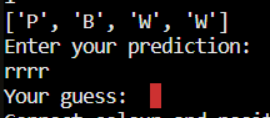
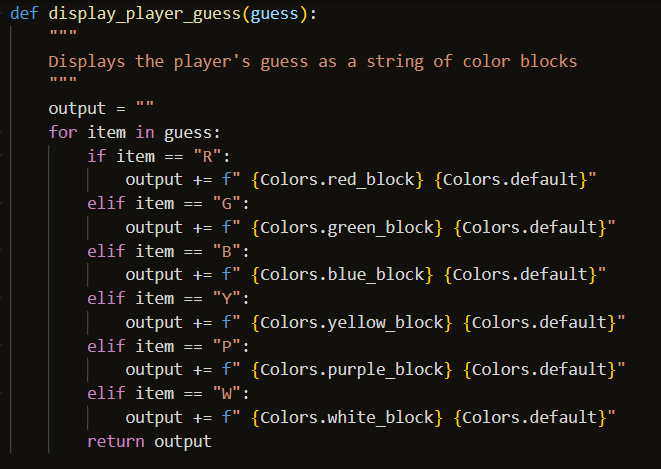
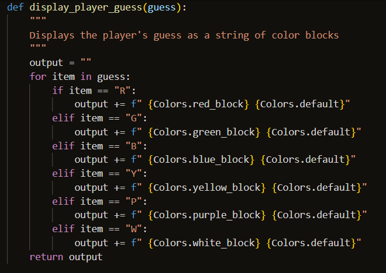

# **MasterCode - Testing**

## **Table of Contents (Testing):**

1. [**Testing Throughout Development**]
   - [**Manual Testing Methods**](#manual-testing-methods)
   - [**Input Testing**](#input-testing)
   - [**Game Logic Testing**](#game-logic-testing)
1. [**Notable Bugs and Fixes**](#notable-bugs-and-fixes)
   - [**_Print Statement Sabotage_**](#print-statement-sabotage)
   - [**_Player Guess Output Predicament_**](#player-guess-output-predicament)
   - [**_Python's Bane: Backslashes in ASCII Art_**](#pythons-bane-backslashes-in-ascii-art)
   - [**_"None" Shall Follow_**](#none-shall-follow)
   - [**_The Curse of the Infinite Loop_**](#the-curse-of-the-infinite-loop)
   - [**_Not Even A Hero Can Escape_**](#not-even-a-hero-can-escape)
1. [**Post Development Testing**](#post-development-testing)
   - [**Validation**](#validation)
   - [**Unresolved Bugs**](#unresolved-bugs)
   - [**Testing Final Deployed Version**](#testing-final-deployed-versiontesting)

## **Testing Throughout Development**

### **Manual Testing Methods**

During the development of this project, I used a number of methods to manually test my code as I went.

(print statement that displayed secret code)

(python3)

(python3 run.py)

([Python Tutor](https://pythontutor.com/python-debugger.html#mode=edit))

([Replit](https://replit.com/~))

### **Input Testing**

(python3 run.py)

(ValueErrors - entering everything wrong on purpose)

(attempt at using getpass)

### **Game Logic Testing**

(print statements)

(where logic relied on input, but input not possible due to bugs/not being defined yet: [Python Tutor](https://pythontutor.com/python-debugger.html#mode=edit))

## **Notable Bugs and Fixes**

Encountering bugs when developing a program in a language such as Python is certainly to be expected, and I encountered a great many of them during the development of this game. Most of the time, these bugs were due to indentation errors, spelling errors, trying to import functions from other files (such as graphics.py) incorrectly, giving functions the wrong arguments (or none at all, when there should have been one), etc. I considered these as to be expected during the development process, so did not make note of them. However, below I have listed some bugs that I did keep record of, because I felt that they all served as noteworthy learning opportunities.

_(I have given them thematically appropriate names to these bugs that tie in with the theme of the game, just for a little fun!)_

### Print Statement Sabotage

The first major bug I encountered during testing was actually the result of testing itself, but it took me quite a while to figure it out. As I've mentioned above, one of the most crucial things I needed to do throughout the development of this game is actually see the randomly generated code so that I could test whether the game was functioning properly. I did this intially for the generate_code() function, but didn't properly begin to utilise this until the majority of the main functions were created. I quickly found quite a significant bug:

The reason it took me so long to identify where this bug was coming from was because I was approaching it from the wrong angle entirely. I was convinced that the issue was in the functions themselves, and so I was taking the functions - _without_ the print statement included - and running them through Python Tutor where I found no issues. Eventually I realised that what I had done was this:

By calling the function inside the print statement, I was asking the program to generate a secret code, then generate _another_ secret code and print _that_ code to the terminal. Upon identifying this, I realised that I needed to define the variable 'original_answer' and call the generate_code() function as its value (this became a crucial addition to the code), and add 'print(original_answer)' below this variable in order for the correct code to print to the terminal and allow for me to test the game effectively.

### Player Guess Output Predicament

Initially, I had not included any kind of visual feedback of the player's guess - the only thing that was output after their guess was the text explaining how many correct answers they had (as shown above in the previous bug's screenshots). Eventually I realised that having the colours displayed to the user as well would vastly improve the overall user experience, and set out to implement it. However, when testing, I came across the following bug:

_Technically_, this output is correct, because the player input is only the colour red. However, I wanted the output to show each individual entry, even if they were all the same colour.

I soon realised that I had incorrectly included the 'return output' statement _inside_ the if/elif statement within the display_player_guess() function's for loop.

I fixed this by correcting the indentation and putting the 'return output' statement at the bottom of the for loop, outside of the if/elif statements.

Although this bug comes under the category of 'indentation bugs', I considered this one to be significant as it made me really consider what I was asking the code to do by having put the statement in the wrong place.

### Python's Bane: Backslashes in ASCII Art

(graphics displaying weirdly due to backslashes)

### "None" Shall Follow

('None' after graphics due to wrapping functions in print())

### The Curse of the Infinite Loop

(play_again() bug where any input led to 'Enter Your Prediction:')

### Not Even A Hero Can Escape

(similar bug with exit game where break was not added)

## **Post Development Testing**

### **Validation**

(code linter)

### **Unresolved Bugs**

(linter issues due to line length, unavoidable due to most of it being code rather than output)

### **Testing Final Deployed Version**

(mention increased frequency in commits & pushes)

(asking friends to test on local machines & deployed version)

Please click the following link to return to the [**README.md**](README.md) file.
